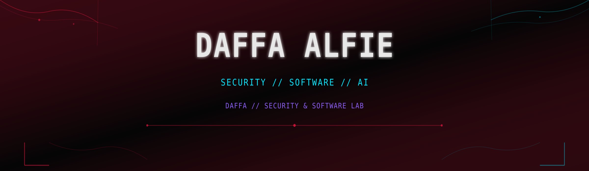

<div align="center">



`◉ SYSTEM ONLINE` `SEC.TRACK: INITIALIZING` `NODE: ALFIEDAFA3`

[](https://github.com/alfiedafa3)
[](https://github.com/alfiedafa3)
[](https://github.com/alfiedafa3)

<br>

[](https://git.io/typing-svg)

</div>

<table>
<tr>
<td width="52%">

### `DAFFA // CONTROL PANEL`

| Signal | Current mode |
|---|---|
| 🔴 BUILDING | **TwoOfUs** |
| 🔵 LEARNING | **Cybersecurity** |
| 🟣 EXPLORING | **Web Security + Linux** |
| 🟢 STATUS | **Online / Building** |
| ⚪ NEXT | **Personal Security Lab** |

</td>
<td width="48%">

### `SOCIAL COMMAND BAR`

[](https://github.com/alfiedafa3)

```text
$ whoami
> Cybersecurity Enthusiast
> Full-Stack Developer
> AI Builder
> Problem Solver
```

</td>
</tr>
</table>

`────────────── ◉ WEB.NODE ◉ ──────────────`

## `01 // IDENTITY`

**DAFFA ALFIE**<br>
Cybersecurity-focused developer exploring the intersection of security, software engineering, and AI.

Currently building real-world applications while developing practical knowledge in Linux, networking, web security, backend engineering, and defensive security.

## `02 // TECHNOLOGY ARSENAL`

### Languages
[](https://www.python.org/)
[](https://www.typescriptlang.org/)
[](https://developer.mozilla.org/en-US/docs/Web/JavaScript)
[](https://html.spec.whatwg.org/)
[](https://www.w3.org/Style/CSS/)

### Frameworks & Development
[](https://nextjs.org/)
[](https://react.dev/)
[](https://nodejs.org/)
[](https://tailwindcss.com/)

### Backend & Infrastructure
[](https://supabase.io/)
[](https://git-scm.com/)
[](https://github.com/)
[](https://www.linux.org/)

### Tools
[](https://code.visualstudio.com/)
[](https://github.com/features/copilot)

`────────────── ◉ DEV.NODE ◉ ──────────────`

## `03 // PROJECT DATABASE` 🕷️

<table>
<tr>
<td width="30%" align="center">

### `TWO OF US`

`AI × RELATIONSHIPS`

🔴 `ACTIVE DEVELOPMENT`

</td>
<td width="70%">

**TwoOfUs** is an AI-powered private relationship companion for shared stories, context, guided missions, and relationship insights.

**STACK**
[](https://nextjs.org/) [](https://www.typescriptlang.org/) [](https://supabase.io/) 

[](https://vd-two-of-dp1hy335h-alfiedafa3-3381s-projects.vercel.app/)

</td>
</tr>
</table>

`────────────── ◉ SEC.TRACK ◉ ──────────────`

## `04 // SECURITY MISSION TREE` 🛡️

| Node | Mission | Signal |
|---:|---|---|
| `01` | **Cybersecurity Fundamentals** |  |
| `02` | **Linux** |  |
| `03` | **Networking** |  |
| `04` | **Web Security** |  |
| `05` | **Defensive Security** |  |
| `06` | **Security Automation** |  |
| `07` | **Personal Security Lab** |  |

## `05 // SECURITY LAB` 🧪

| Module | State |
|---|---|
| Web Security | `PLANNED` |
| Network Analysis | `PLANNED` |
| Linux Security | `PLANNED` |
| Defensive Security | `PLANNED` |
| Vulnerability Assessment | `PLANNED` |
| Security Automation | `PLANNED` |

**NEXT OBJECTIVE:** Build an isolated hands-on security environment.

`────────────── ◉ BUILD.MODE ◉ ──────────────`

## `06 // CONTRIBUTION ARCADE` 🕸️

`SNAKE.RUNNER :: CONTRIBUTION CELLS :: OUTPUT BRANCH`

<div align="center">


</div>

## `07 // BUILD LOG` 📟

```text
daffa@cyber-lab:~$ cat build.log

[2026] PROFILE.SYS
    Building public developer identity

[2026] TWOOFUS.APP
    AI-powered relationship companion

[NEXT] SECURITY.LAB
    Initializing practical security environment...
```

`────────────── ◉ CONNECTION.NODE ◉ ──────────────`

## `08 // CONNECTION`

[](https://github.com/alfiedafa3) [](https://vd-two-of-dp1hy335h-alfiedafa3-3381s-projects.vercel.app/)

<div align="center">

`BUILD DEEPER.` `LEARN FASTER.` `SECURE BETTER.`

**Thanks for visiting. Keep building.**

</div>
