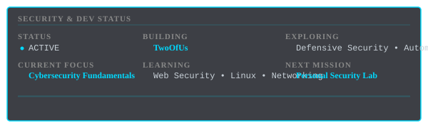

   
  <h1 style="font-size: 2.8em; color: #00d9ff; text-shadow: 0 0 15px #00d9ff; font-weight: 800; letter-spacing: 3px; margin-bottom: 10px;">
    DAFFA ALFIE
  </h1>
  
  

    Cybersecurity Enthusiast • Full-Stack Developer • AI Builder
  

  
  

    Building secure systems. Understanding how they break. Learning to defend them.
  

  
  
DAFFA // SECURITY & SOFTWARE LAB

  

---

## ⚡ Security & Dev Status

---

<table style="width: 100%; border-collapse: collapse; border: none; background: transparent;">
  <tr style="border: none;">
    <td style="width: 50%; padding: 20px; border: none; vertical-align: top;">
      <h2 style="color: #00d9ff; margin-top: 0; border-bottom: 2px solid #00d9ff; padding-bottom: 8px;">🎯 About Me</h2>
      

        I'm building toward a career in <strong>cybersecurity</strong> and <strong>software engineering</strong>, with growing interest in <strong>AI</strong>. I focus on understanding security from first principles and building secure, scalable systems.
      

      

        <strong>What I'm Focused On:</strong>
      

      <ul style="color: #888; font-size: 0.93em; line-height: 1.8; margin: 10px 0;">
        <li>Cybersecurity fundamentals and defensive practices</li>
        <li>Full-stack development with modern frameworks</li>
        <li>Backend engineering and system design</li>
        <li>AI integration and real-world applications</li>
      </ul>
    </td>
    <td style="width: 50%; padding: 20px; border: none; vertical-align: top;">
      <h2 style="color: #00d9ff; margin-top: 0; border-bottom: 2px solid #00d9ff; padding-bottom: 8px;">📊 Quick Stats</h2>
      

        
      

    </td>
  </tr>
</table>

---

<table style="width: 100%; border-collapse: collapse; border: none; background: transparent;">
  <tr style="border: none;">
    <td style="width: 50%; padding: 20px; border: none; vertical-align: top;">
      <h2 style="color: #00d9ff; margin-top: 0; border-bottom: 2px solid #00d9ff; padding-bottom: 8px;">📚 Currently Learning</h2>
      
Active areas of study and growth:

      <ul style="color: #c9d1d9; font-size: 0.93em; line-height: 1.9; margin: 0; padding-left: 20px;">
        <li>Cybersecurity Fundamentals</li>
        <li>Linux Administration & Security</li>
        <li>Networking Concepts</li>
        <li>Web Security & OWASP</li>
        <li>Backend Engineering</li>
        <li>Security Automation</li>
      </ul>
    </td>
    <td style="width: 50%; padding: 20px; border: none; vertical-align: top;">
      <h2 style="color: #00d9ff; margin-top: 0; border-bottom: 2px solid #00d9ff; padding-bottom: 8px;">🛠️ Tech Stack</h2>
      
      
Languages

      

        
        
        
      

      
      
Frameworks

      

        
        
        
      

      
      
Infrastructure

      

        
        
        
      

    </td>
  </tr>
</table>

---

<h2 style="color: #00d9ff; border-bottom: 2px solid #00d9ff; padding-bottom: 8px;">🛡️ Security Roadmap</h2>

  
**Cybersecurity Fundamentals** — `CURRENT`
> Understanding core security concepts, threat models, and defensive principles

**↓**

**Linux Fundamentals & Security** — `LEARNING`
> System administration, access control, security hardening

**↓**

**Networking & Web Security** — `LEARNING`
> TCP/IP, protocols, OWASP vulnerabilities, secure coding

**↓**

**Defensive Security** — `NEXT`
> Threat modeling, vulnerability assessment, security automation

**↓**

**Personal Security Lab** — `PLANNED`
> Building hands-on environment for applied learning

---

<h2 style="color: #00d9ff; border-bottom: 2px solid #00d9ff; padding-bottom: 8px;">📦 Featured Projects</h2>

  
### TwoOfUs
**AI-powered relationship companion** — Full-stack development with real-world AI integration

Helps partners communicate better through AI-assisted insights, context understanding, guided missions, and relationship reflection.

**Stack:** Next.js • TypeScript • Supabase • AI  
**Repository:** [github.com/alfiedafa3/VD-TwoOfUs](https://github.com/alfiedafa3/VD-TwoOfUs)  
**Status:** Active Development

---

<h2 style="color: #00d9ff; border-bottom: 2px solid #00d9ff; padding-bottom: 8px;">🔬 Security Lab</h2>

**Personal Security Lab** — `STATUS: PLANNED`

Building a personal environment for applied security learning and experimentation.

**Future Areas:**
- Web Security Testing & Analysis
- Network Security & Analysis
- Linux Security Hardening
- Defensive Security Tools
- Vulnerability Assessment
- Security Automation Scripts

*Labs, CTFs, write-ups, and experiments will be documented here as they develop.*

---

<h2 style="color: #00d9ff; border-bottom: 2px solid #00d9ff; padding-bottom: 8px;">📖 Build Log</h2>

**2026**
- → **GitHub Profile** — Building public developer identity and security learning documentation
- → **TwoOfUs** — AI-powered relationship companion with full-stack architecture

---

  <h2 style="color: #00d9ff; border-bottom: 2px solid #00d9ff; display: inline-block; padding-bottom: 8px;">🔗 Connect</h2>
    
  

---

  
Serious about security. Learning continuously. Building real systems.

