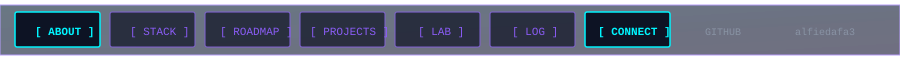
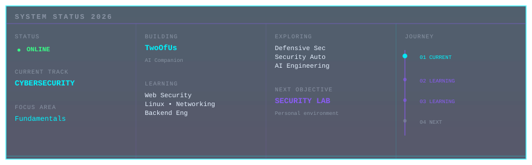
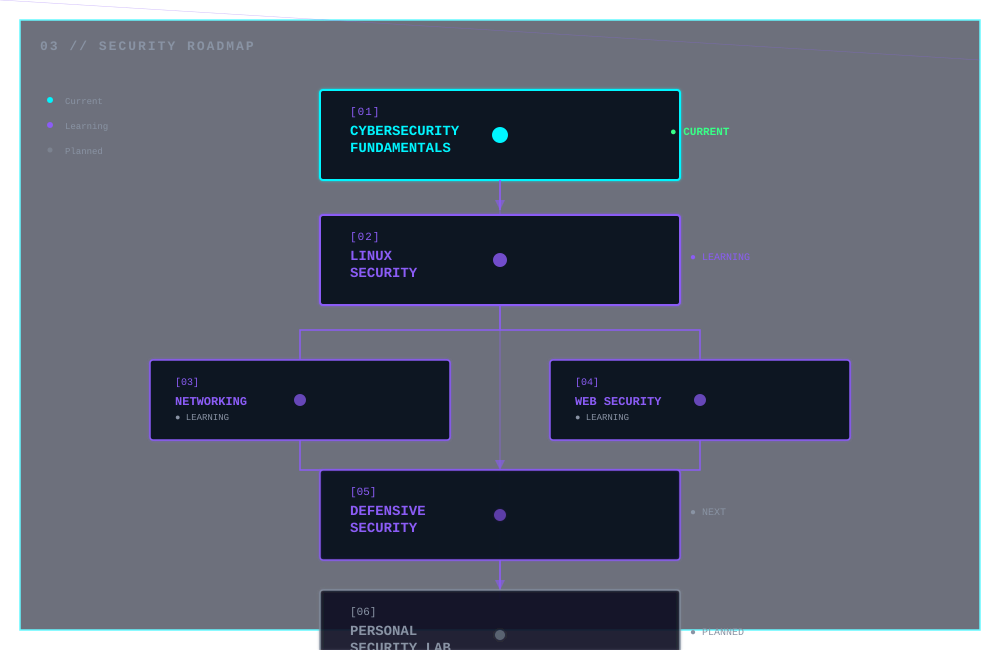
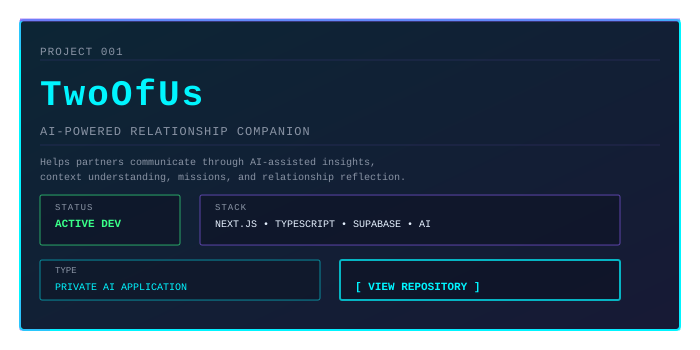

---



---



---

## 01 // IDENTITY

**Daffa Alfie** — Building toward a career in **cybersecurity**, **software engineering**, and **artificial intelligence**.

I approach security and engineering from first principles, focusing on understanding systems deeply before securing them. My work combines practical full-stack development with continuous learning in security fundamentals, defensive practices, and system design.

**Current Mission:** Master cybersecurity fundamentals while building real software. Understanding the intersection of engineering excellence and security.

---

## 02 // TECHNOLOGY

### LANGUAGES
[](https://www.python.org/)
[](https://www.typescriptlang.org/)
[](https://developer.mozilla.org/en-US/docs/Web/JavaScript)
[](https://html.spec.whatwg.org/)
[](https://www.w3.org/Style/CSS/)

### DEVELOPMENT & FRAMEWORKS
[](https://nextjs.org/)
[](https://react.dev/)
[](https://nodejs.org/)
[](https://tailwindcss.com/)

### BACKEND & INFRASTRUCTURE
[](https://supabase.io/)
[](https://git-scm.com/)
[](https://github.com/)
[](https://www.linux.org/)

### TOOLS
[](https://code.visualstudio.com/)
[](https://github.com/features/copilot)

---

## 03 // SECURITY ROADMAP



**Current Focus:** Cybersecurity Fundamentals

Understanding core security concepts, threat models, defensive principles, and how systems can be attacked and defended.

---

## 04 // PROJECT DATABASE

[](https://github.com/alfiedafa3/VD-TwoOfUs)

**Status:** Active Development

TwoOfUs is an AI-powered relationship companion helping partners communicate better. Built with modern full-stack technologies and AI integration, it demonstrates real-world application of secure backend systems with intelligent features.

**Repository:** [github.com/alfiedafa3/VD-TwoOfUs](https://github.com/alfiedafa3/VD-TwoOfUs)

---

## 05 // SECURITY LAB

**Personal Security Environment** — `STATUS: PLANNED`

Building an isolated laboratory for applied security learning and experimentation.

### Planned Modules
- Web Security Testing & Analysis
- Network Analysis & Monitoring
- Linux Security Hardening
- Defensive Security Tools
- Vulnerability Assessment Frameworks
- Security Automation Scripts

**Next Objective:** Establish hands-on environment for CTFs, labs, vulnerability research, and security tool development.

---

## 06 // BUILD LOG

```
2026.08
> PROFILE.SYS — Building public developer identity
> TWOOFUS.APP — AI-powered relationship companion
```

---

## 07 // CONNECTION

**GitHub:** [alfiedafa3](https://github.com/alfiedafa3)

---

<div align="center" style="padding-top: 30px; margin-top: 40px; border-top: 1px solid rgba(0, 245, 255, 0.1);">
  <p style="color: #8993A4; font-family: 'Courier New', monospace; font-size: 0.9em; letter-spacing: 1px;">Serious about security. Learning continuously. Building real systems.</p>
</div>
